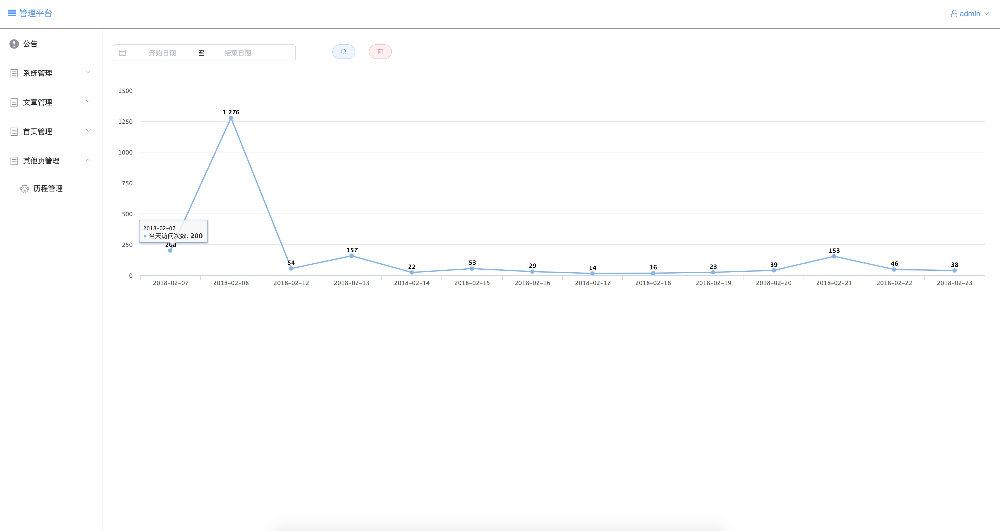
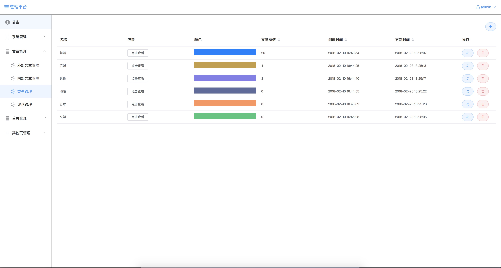
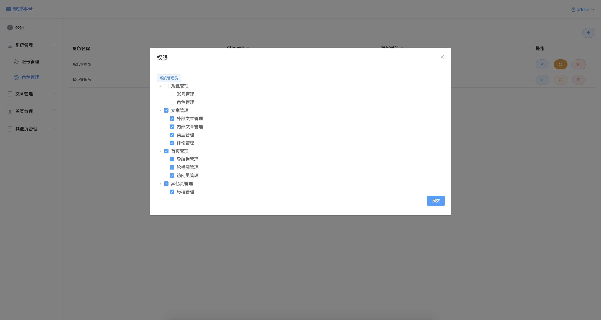

```
前端使用vue，首页使用ssr，内容页面使用vue-cli改造的多页应用，有后台管理系统。
canvas特效是抄的，稍微改造了一下。
访问页面做了一些简单的埋点
地址: https://zouchenwd.cn/
```

```
后端使用spring-boot(第一次使用能力有限代码稀烂)
本地想跑起来搭建一个本地mysql，在spring-boot项目里src/resources/application.yml文件里的active改成dev模式使用srping-data-jpa自动往mysql db里建表
数据库使用的传统的mysql,数据库基本配置在dev和prod环境设置
git地址：https://github.com/z5829984520/myBlog-back-java
```


```
适合会前端人改造下做二次开发。
```

```
使用方法
npm run dev
```
---

>附上后台管理一些截图



